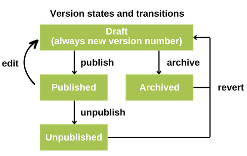

Publishing
==========

.. include:: ../versioning-note.include

In Django CMS, publishing and versioning are crucial aspects for editors managing
content. Here's a breakdown of how they work:

Publishing
----------

Publishing refers to making content available to website visitors. In Django CMS, you
typically create or edit content using a **draft**, which means the unfinished content
or changes are not immediately visible to the public. Editors can work on content
privately until it's ready for publication.

This is the typical workflow:

1. **Create Draft:** Editors create or modify content only in a draft version within the
   CMS admin interface.
2. **Preview:** They can preview how the content will appear on the live site before
   publishing.
3. **Publish:** When ready, editors can publish the changes to make them visible on the
   live website for visitors to see.

Published content cannot be changed any more. To make additional changes, create a start
over the process and create a new draft based on the published version.

Managing versions
-----------------

Versions in Django CMS keep track of changes made to content over time. This feature
allows editors to revert to earlier versions of content if needed and view the history
of modifications:

1. **Version History:** Django CMS maintains a history of all changes made to a
   particular piece of content.
2. **Compare Versions:** Editors can compare different versions of content to see what
   changes were made between each iteration.
3. **Rollback:** If necessary, editors can revert to a previous version of the content,
   effectively undoing recent changes.

These functionalities empower editors to manage content effectively, ensuring quality
and control over what gets published on the live site while maintaining a history of
changes for reference or restoration purposes.

    This diagram summarizes the possible states and the actions which create a change in
    the state of a version.

Locked versions
---------------

.. note::

    This feature is not enabled in all installations of django CMS. See `django CMS
    Versioning documentation
    <https://djangocms-versioning.readthedocs.io/en/latest/settings.html#DJANGOCMS_VERSIONING_LOCK_VERSIONS>`_
    for more information.

Version locking in Django CMS is a feature that automatically locks each draft version
of a content item to prevent unintended modifications or edits. A locked draft can only
be changed by the person who created the draft. This functionality is particularly
useful when you want to ensure that not two editors make changes to a specific content,
ensuring changes do not interfere with each other.
