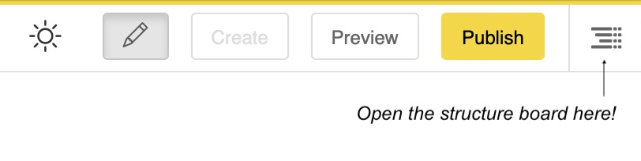

Structure and content modes
===========================

When editing in django CMS you constantly switch between two perspectives on the same
page: the **structure board**, which shows the page as a tree of plugins, and the
**content view**, which shows the page as visitors will see it. This page explains why
there are two modes and what each is for.

You can toggle between structure and content mode by clicking the button on the far
right of the toolbar (or by pressing the space bar while editing).

Two modes for two kinds of thinking
-----------------------------------

Editing a page involves two quite different activities:

- **Arranging** — deciding what building blocks the page consists of and in what
  order: a container, a heading, two columns, an image beside a text. This is
  layout thinking, and it is what **structure mode** is for. The structure board
  shows every :ref:`placeholder <explanation-placeholders>` and the tree of
  :ref:`plugins <explanation-plugins>` inside it — including elements that are
  invisible in the rendered page, such as empty containers or layout wrappers. Here
  you add plugins, nest them, and rearrange them by drag & drop.

- **Writing** — working on the actual words and pictures. This is what **content
  mode** is for. You see the page exactly as it will be rendered and edit elements
  in place by double-clicking them (or, with inline editing enabled, by typing
  directly into the text).

Neither view alone would suffice. The rendered page hides structure: you cannot see
(let alone rearrange) an invisible container, and nested layouts are hard to grasp
from their visual result. The structure tree, in turn, is a poor place to judge how a
paragraph reads or whether an image works. The two modes give each activity the
representation that fits it.

How they work together
----------------------

A typical editing session moves back and forth: open the structure board to set up or
adjust the skeleton of the page, switch to content mode to fill in and polish the
content, and back again when the layout needs to change. Changes made in one mode are
immediately reflected in the other — they are two views of the same plugin tree, not
two different copies of the page.

.. tip::

    In the structure board, hover over a plugin while pressing the **SHIFT** key to
    highlight the corresponding element on the page — useful for finding out which
    tree entry belongs to which visible element.
