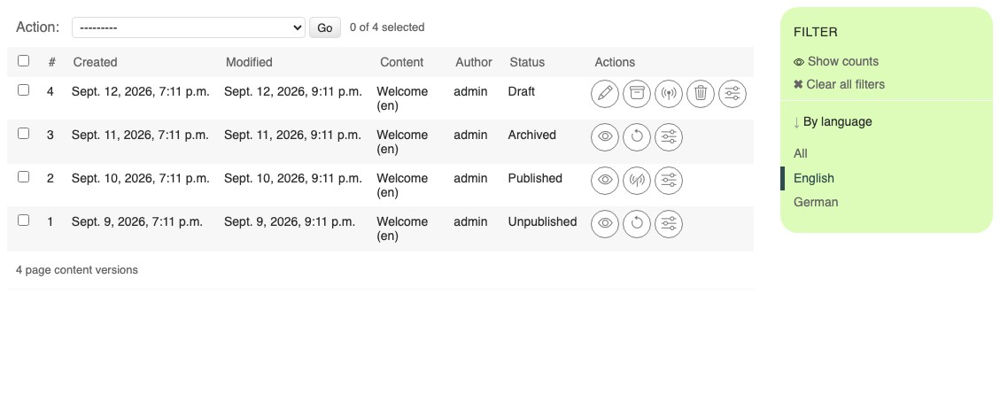

.. _how-to-versions:

Managing versions
=================

.. include:: ../versioning-note.include

With djangocms-versioning, published and archived versions remain available in the
version history. This guide shows how to find the versions of a page, compare them, and
restore or discard one. A discarded or deleted draft cannot be recovered. The states
themselves — draft, published, unpublished and archived — and the actions available in
each state are listed in the :ref:`version states reference <ref-version-states>`.

If you have only just made the unwanted change, first look for the optional **Undo**
button in the toolbar. Undo and Redo work with recent editing actions; versions are for
comparing and recovering retained states of the whole content item.

Choose the right action
-----------------------

=============================== ===================== =================================
What you want                   Action                Result
=============================== ===================== =================================
Remove unwanted draft changes   **Discard / Delete**  Permanently removes the draft;
                                                      the published version stays live.
Set unfinished work aside       **Archive**           Keeps the content in version
                                                      history without making it live.
Restore older content           **Revert**            Creates a new draft from a
                                                      retained version for review and
                                                      publishing.
Take content offline            **Unpublish**         Removes the public version but
                                                      keeps it in version history.
Remove a page permanently       **Delete page**       Deletes the page, its sub-pages
                                                      and their versions; this cannot
                                                      be undone. See :ref:`Managing
                                                      pages <how-to-pages>`.
=============================== ===================== =================================

Open the "manage versions" view
-------------------------------

Either

- Select "Pages..." in the project menu of the toolbar and look for the page the versions
  of which you want to manage.
- Click on the status indicator to open the dropdown menu.
- Select "Manage versions...".

or

- Preview or edit the page the versions of which you want to manage.
- Click on the version menu and choose "Manage versions...".

  .. image:: ../tutorial/images/08-version-menu-open.jpg
      :alt: Version menu with actions for managing and comparing versions

What the version list shows
---------------------------

Each row describes one version: the dates it was created and last modified, its title
and language, the user who created it, its state, and the action buttons available for
that state.

Compare two versions
--------------------

1. Select exactly two versions to compare by checking the box on their left side.
2. From the pull-down menu marked ``-------`` select "Compare versions".
3. Click "Go".

   .. image:: ../tutorial/images/08-comparing-versions.jpg
       :alt: Comparing two versions

Added content is marked green, deleted content is marked red.

.. _how-to-revert:

Revert to a previous version
----------------------------

If a published change turns out to be wrong, you can restore an earlier version:

1. Open the **"manage versions"** view of the page (see above) and make sure you are
   looking at the right language.
2. Find the version you want to restore. If you are unsure, compare it to the current
   version first (see "Compare two versions" above).
3. Click the **"Revert"** action button of that unpublished or archived version. A new
   draft with the content of that version is created.

   .. note::

       If a draft already exists, django CMS asks you whether to discard it — a page
       can only have one draft per language at a time.

4. Review the new draft and click **"Publish"** in the toolbar to make it live.

Reverting never deletes history: the previously published version is marked
"unpublished" and remains available in the version list.

Unpublish content temporarily
-----------------------------

1. Open the **"manage versions"** view and find the published version in the correct
   language.
2. Select its **"Unpublish"** action and confirm.

Visitors can no longer open that language version. Its content remains in the version
history, where you can revert it into a new draft and publish it again. This is different
from hiding a page in navigation: a hidden published page still works at its URL.

Archive unfinished work
-----------------------

1. Open the **"manage versions"** view and find the draft.
2. Select its **"Archive"** action.

The archived version is kept but cannot be edited directly. When you want to continue,
select **"Revert"** on that archived version to create a new draft.

Discard a draft
---------------

To throw away unpublished changes:

1. Open the page in preview or edit mode.
2. Open the **version menu** in the toolbar and select **"Discard Changes"**, then
   confirm.

Alternatively, delete the draft from the "manage versions" view using its **delete**
action button. In both cases the published version stays untouched and remains live;
only the unpublished draft is removed. Discarding a draft cannot be undone — if you
might need the changes later, **archive** the draft instead.
