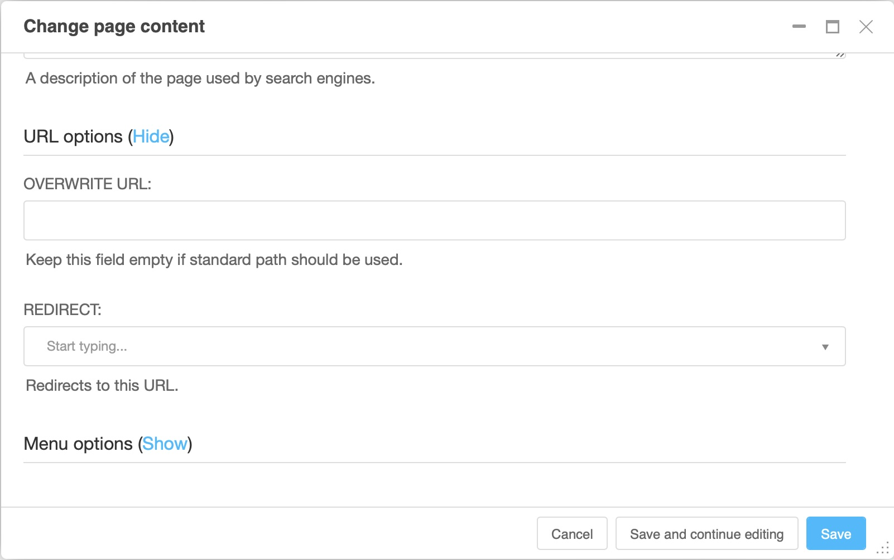

.. _ref-page-settings:

Page settings reference
=======================

This page describes the fields of the page settings and advanced settings dialogs. For
a guided introduction, see :ref:`page settings in the tutorial <page-settings>`.

Open the page settings via **"Page settings..."** in the page menu of the toolbar, or
via the settings icon of a page's row in the :ref:`page tree <pagetree>`. The advanced
settings are available via **"Advanced settings..."** in the page menu or via the
"Advanced settings" button at the bottom of the page settings dialog.

.. note::

    Title, slug and the other basic settings exist **once per language**. Use the
    language tabs at the top of the dialog to switch languages. Changes to a draft
    only take effect when the draft is published.

Basic settings
--------------

.. image:: ../tutorial/images/02-page-settings.jpg
    :alt: The page settings dialogue

======================== ========= ======================================================
Field                    Required  Meaning
======================== ========= ======================================================
**Title**                yes       The default title of the page. Displayed at the top
                                   of the page (depending on the template), used by
                                   search engines, and reused as menu title and page
                                   title if those are empty.
**Slug**                 yes       The part of the URL identifying this page. Generated
                                   automatically from the title; can be edited. Keep
                                   slugs short and meaningful. See :ref:`Change a
                                   page's URL (slug) safely <how-to-change-slug>`.
**Menu title**           no        Replaces the title in the navigation menu. Useful
                                   when the full title is too long for menus.
**Page title**           no        Replaces the title in search engine results and the
                                   browser tab. Avoid much more than 60 characters —
                                   longer titles are cut off in search results.
**Description meta tag** no        A short summary used by search engines in result
                                   snippets and by social networks when the page is
                                   shared.
======================== ========= ======================================================

URL options
-----------

The URL options are collapsed by default; click **"Show"** to expand the section.

================== =====================================================================
Field              Meaning
================== =====================================================================
**Overwrite URL**  Replaces the default URL (the page's slug appended to its parents'
                   path) with a fixed path. The page keeps its position in the page
                   tree. Use sparingly — it makes URLs harder to predict.
**Redirect**       Redirects visitors of this page to another page. Used to preserve
                   bookmarks and search engine rankings when content moves. See
                   :ref:`Managing redirects <how-to-redirects>`.
================== =====================================================================

Advanced settings
-----------------

.. note::

    Most advanced settings affect how the site is built and are usually managed by
    your site's developers. If in doubt, leave them unchanged.

========================== =============================================================
Field                      Meaning
========================== =============================================================
**Template**               The template used to render the page. "Inherit the template
                           of the nearest ancestor" applies the template of the parent
                           page.
**Id**                     A unique identifier developers use to link to this page from
                           templates, independent of its URL.
**Soft root**              Makes this page act as the root of the navigation menu when
                           it is viewed — menus do not show pages above it.
**Attached menu**          Attaches an additional, developer-provided menu to this
                           page.
**Application**            Hooks a separate application (for example a blog or shop)
                           into the site under this page's URL.
**X Frame Options**        Controls whether the page may be embedded in a frame on
                           other websites.
========================== =============================================================

Permissions
-----------

If page permissions are enabled on your site, the advanced settings also let you
restrict who can **view** the page (login required, or specific users and groups) and
who can **edit** it. Pages without view restrictions are visible to everyone once
published.
