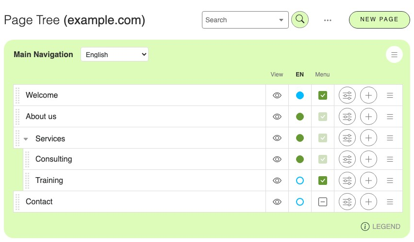
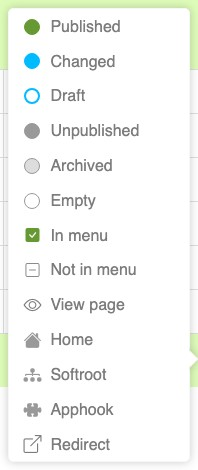

.. _ref-page-tree:

Page tree reference
===================

The page tree lists every page of your site — published or not, shown in the navigation
or not — and is the starting point for most page management tasks. This page describes
what the tree displays. For a guided introduction see :ref:`the page tree in the
tutorial <pagetree>`; for the tasks themselves see :ref:`Managing pages <how-to-pages>`.

Opening the page tree
---------------------

- Select **"Pages..."** in the project menu of the toolbar. The page tree opens in the
  sidebar.
- Alternatively, open **"Administration..."** in the project menu and click **"Page
  contents"** in the "django CMS" section.

Anatomy of a row
----------------

From left to right, each row of the tree contains:

=== ============================ ==========================================================
Nr  Element                      Meaning
=== ============================ ==========================================================
1   **Language menu**            Selects which language version of the page tree is
                                 displayed. It sits above the tree and applies to all
                                 rows.
2   **Drag handle**              The dotted bar used to move the page by drag & drop.
3   **Collapse arrow**           Shown only for pages that have sub-pages; shows or hides
                                 the page's child pages.
4   **Page title**               The title in the selected language. "Empty title" means
                                 the page has no version in that language yet.
5   **Root indicator**           A house marks the page served at the site's root URL. A
                                 puzzle symbol marks a page handled by a third-party
                                 application.
6   **Preview (eye) icon**       Opens the page in preview mode.
7   **Publication status menu**  The current state of the page in the selected language;
                                 see `Publication status colours`_ below. Clicking it
                                 opens the available version actions.
8   **"Menu" column**            Whether the page appears in the site's navigation menu:
                                 a green check means visible, a grey unchecked mark means
                                 hidden.
9   **Settings button**          Opens the :ref:`page settings <ref-page-settings>` of the
                                 page.
10  **Add button**               Creates a child page below this page.
11  **Context menu**             The hamburger menu with further actions; see `Context
                                 menu entries`_ below.
=== ============================ ==========================================================

Publication status colours
--------------------------

The colour of the publication status menu (number 7) reports the state of the page in
the selected language:

============================ =================================================================
Colour                       Meaning
============================ =================================================================
**Blank**                    The page has no version in this language.
**White with blue border**   An unpublished draft exists; there is no public version of
                             the page.
**Green**                    The page is published in this language.
**Blue**                     A draft with unpublished changes exists alongside the
                             published version.
============================ =================================================================

The states themselves are described in the :ref:`version states reference
<ref-version-states>`.

Context menu entries
--------------------

The hamburger menu at the right end of a row (number 11) offers:

========================= =========================================================
Entry                     Action
========================= =========================================================
**Copy**                  Copies the page including its sub-pages, ready to be
                          pasted.
**Cut**                   Removes the page, ready to be pasted elsewhere in the
                          tree.
**Paste**                 Inserts a previously cut or copied page as a child of
                          this page.
**Delete...**             Deletes the page, its sub-pages and all their versions in
                          all languages, after confirmation.
**Set as home**           Makes this page the page served at the site's root URL.
**Advanced settings**     Opens the :ref:`advanced settings <ref-page-settings>` of
                          the page.
========================= =========================================================

The menu also reports the date of the last change, whether access to the page is
restricted, and the author of the last modification.

Above the tree
--------------

At the top right of the page tree you find:

- a **search** button to find a page by title,
- a **"..."** button to choose which site's tree is displayed (most installations serve
  a single site),
- an **add page** button that creates a new top-level page.

The legend
----------

The information icon at the bottom right opens a legend listing every symbol used in
the page tree:

