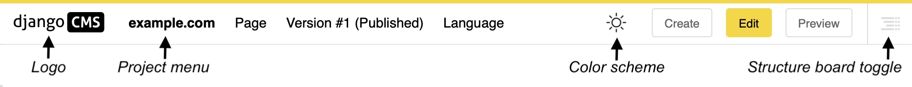
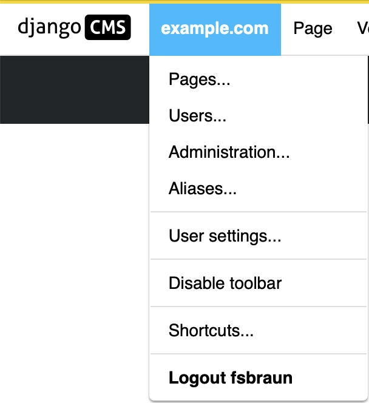
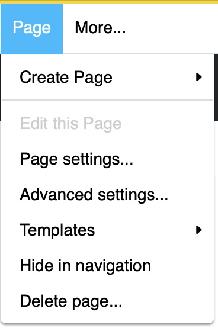
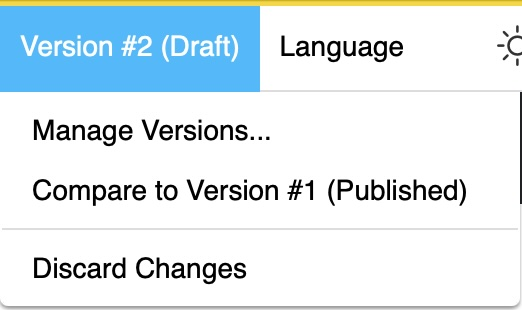
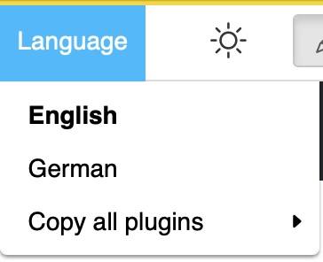

.. _ref-toolbar:

Toolbar reference
=================

This page describes every element of the django CMS toolbar. For a guided
introduction, see the :ref:`toolbar tutorial <toolbar>`.

From left to right, the toolbar contains:

1. The **django CMS logo** — returns you to the home page.
2. The **project menu**, labelled with the name of your site.
3. The **page menu**.
4. Context-dependent menus, e.g. the **version menu** and the **language menu**.
5. The **colour scheme toggle**.
6. Context-dependent **action buttons**.
7. The **structure board toggle**.

Which menus and entries appear depends on the packages installed on your site and the
content you are viewing; entries beyond the ones listed here may be added by other
components (for example, a blog application).

The project menu
----------------

============================ ===========================================================
Entry                        Action
============================ ===========================================================
**Pages...**                 Opens the :ref:`page tree <pagetree>` of your site in the
                             sidebar.
**Users...**                 Opens the user management panel in the sidebar.
**Administration...**        Opens the full administration interface in the sidebar.
**Aliases...**               Opens the list of :ref:`aliases <explanation-aliases>` —
                             content elements reused across the site (requires
                             djangocms-alias).
**User settings**            Sets the language of the administration interface and
                             toolbar.
**Disable toolbar**          Completely disables the toolbar and the front-end editor
                             for your user. To re-enable it, add ``?toolbar_on`` to the
                             end of the URL in your browser.
**Shortcuts**                Gives access to your shortcuts.
**Logout <username>**        Logs you out.
============================ ===========================================================

The page menu
-------------

============================ ===========================================================
Entry                        Action
============================ ===========================================================
**Create page**              Creates a **new page** (a sibling of the current page), a
                             **new sub page** (a child of the current page), or a
                             **duplicate** of the current page.
**Edit this page**           Switches the current page to edit mode.
**Page settings...**         Opens the :ref:`page settings <ref-page-settings>` of the
                             current page.
**Advanced settings...**     Opens the :ref:`advanced settings <ref-page-settings>` of
                             the current page, including its permissions.
**Templates**                Selects the template of the page, or inherits the template
                             from the closest parent page.
**Hide/show in navigation**  Toggles whether the page appears in the site's navigation
                             menu.
**Delete page...**           Deletes the page including its sub-pages, after
                             confirmation.
============================ ===========================================================

The version menu
----------------

.. include:: ../versioning-note.include

The menu title shows the version number of the content you are viewing (counted per
language) and its state — see the :ref:`version states reference
<ref-version-states>`.

=============================== ========================================================
Entry                           Action
=============================== ========================================================
**Manage versions...**          Lists all versions of this content in the sidebar.
**Compare to version <x>...**   Visually compares the version you are viewing with
                                another version. Differences are highlighted on the
                                page or in its source code.
**Discard changes**             Deletes the current draft. The published version, if
                                any, remains untouched.
=============================== ========================================================

The language menu
-----------------

The language menu is only shown on multilingual sites. It switches between the
language versions of the content you are viewing, and contains entries to **add a
translation**, **delete a translation**, and **copy all plugins** from another
language into the current one. See :ref:`Translating a page <how-to-translations>`.

The action buttons
------------------

The buttons on the right-hand side of the toolbar depend on the state of the content
you are viewing:

=================== ====================================================================
Button              Action
=================== ====================================================================
**Create**          Opens the creation wizard for a new page or other content types
                    available on your site.
**Edit**            Opens the current content in edit mode.
**New Draft**       Creates a new draft based on the published version and opens it in
                    edit mode.
**Preview**         Switches to preview mode: shows the content as visitors would see
                    it, without making it public. Also works for unpublished content.
**View published**  Opens the currently published version of the page.
**Publish**         Makes the current draft the published version. A previously
                    published version becomes "unpublished".
=================== ====================================================================

Display toggles
---------------

- The **colour scheme toggle** (sun/moon icon) switches the django CMS interface
  elements between light and dark mode. It does not affect what visitors see.
- The **structure board toggle** (far right) opens and closes the structure board used
  to arrange plugins. In edit mode you can also toggle it with the space bar.
