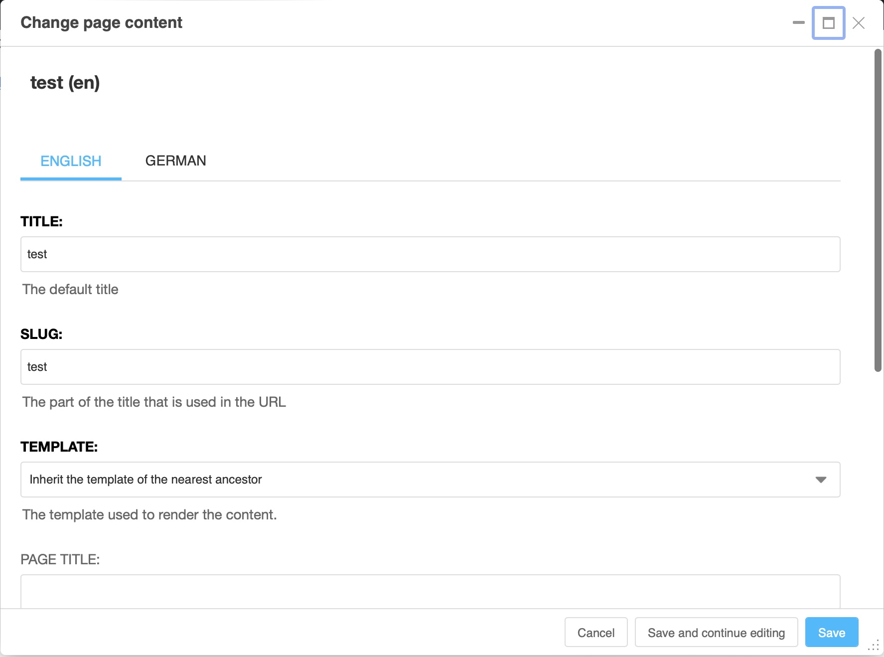

.. _toolbar:

The toolbar
===========

When you are logged in to your site, the django CMS toolbar appears at the top of the
browser window. It is your control centre for everything you will do in this tutorial:
creating pages, editing content, and publishing. In this lesson you take a quick tour
of its menus.

.. image:: ./images/02-toolbar.jpg
    :alt: The django CMS toolbar

Depending on the modules present on your site and the page you are on, you can find
various elements. The only ones that will always be present are "Project", "Page" and
"Language". For example, a "Blog" menu will only be displayed if you have this module
and you are on a blog page.

One element is constantly present in your toolbar: the **django CMS logo** on the very
left. Click on it now — it simply takes you back to your home page.

.. tip::

    This lesson introduces each menu briefly. The complete list of all menu entries
    and buttons is in the :ref:`toolbar reference <ref-toolbar>` — you don't need to
    memorise them now.

The project menu
----------------

The first menu carries the name of your site ("example.com" on the screenshots here).
It gives you access to everything that concerns the site as a whole. Open it and have
a look:

.. image:: ./images/02-project-menu.jpg
    :alt: The Project menu
    :scale: 50

The entries you will use most are **"Pages..."**, which opens the page tree of your
site in a sidebar (we explore it in :ref:`lesson 5 <pagetree>`), and
**"Administration..."**, which opens the management interface (:ref:`lesson 3
<sidebar>`). Close the sidebar again with the cross at its top right.

.. note::

    You might not see all of the elements described here, or even more elements. This
    strongly depends on your django CMS setup.

.. note::

    If you choose "Disable toolbar", you can only make the toolbar reappear by adding
    ``?toolbar_on`` to the end of the URL in your browser window.

The page menu
-------------

The "Page" menu collects all actions that concern the page you are currently viewing.

.. image:: ./images/02-page-menu.jpg
    :alt: The Page menu
    :scale: 50

From here you can **create new pages** (a new page next to this one, a sub-page below
it, or a duplicate), switch to **editing** the page, and open the **page settings**.
We will use all of these in :ref:`lesson 6 <content>` when we create a page.

Open **"Page settings..."** now and look at the two most important fields, then close
the dialog again without saving:

- **Title:** the title of your page that you enter when creating it.
- **Slug:** generated automatically from the title; it is what appears at the end of
  the page's URL.

The page settings are available separately for each language of the page — note the
language tabs at the top of the dialog. All other fields are described in the
:ref:`page settings reference <ref-page-settings>`.

The version menu
----------------

.. image:: ./images/02-version-menu.jpg
    :alt: The version menu
    :scale: 50

django CMS keeps every page as a series of versions, so nothing you edit is visible to
visitors until you publish it, and nothing published is ever lost. The version menu
shows the number and status of the version you are looking at — for example "Draft"
while you are editing. We will work with versions in :ref:`lesson 8 <publishing>`;
the states are listed in the :ref:`version states reference <ref-version-states>`.

The language menu
-----------------

.. image:: ./images/02-language-menu.jpg
    :alt: The language menu
    :scale: 50

On multilingual sites, the "Language" menu switches between the language versions of
the page you are viewing. It also lets you add, delete or copy translations — see
:ref:`Translating a page <how-to-translations>` for the details. The language menu
will be missing in single-language configurations.

The right-hand side
-------------------

On the right-hand side of the toolbar you find:

- The **colour scheme toggle**, which switches the django CMS interface elements
  between light and dark. Try it — it does not affect what your visitors see.
- The **action buttons**, which change with the state of the page: **Create**,
  **Edit**, **New Draft**, **Preview**, **View published** and **Publish**. These
  buttons drive the editing workflow you will follow in the rest of this tutorial.
- The **structure board toggle** in the far corner, which is central to editing
  content — it gets its own lesson (:ref:`lesson 7 <plugins>`).

All buttons are described in the :ref:`toolbar reference <ref-toolbar>`.
