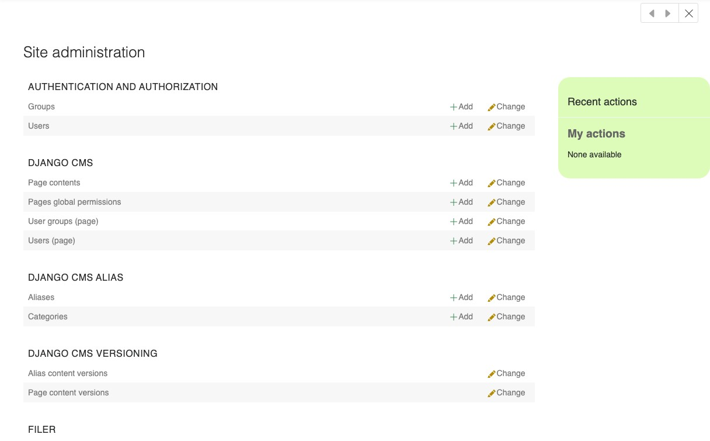

.. _sidebar:

The administration sidebar
==========================

Not everything lives on the page you are looking at. Your site's users, its media files
and the settings of the applications it runs are managed in the **administration
interface**, which django CMS opens in a sidebar over your page.

Open it now: in the **project menu**, select **"Administration..."**.

What you find here depends on the packages installed on your site, so your sidebar will
not look exactly like the screenshot. It holds the same sections as your site's
administration pages. Two of them matter for this tutorial:

- **django CMS**, which contains "Page contents" — another way into the page tree you
  will meet in :ref:`lesson 5 <pagetree>`.
- **Filer**, the media library where your images live. That is the next lesson.

Close the sidebar again with the cross at its top right, or by clicking on the page
outside it.
