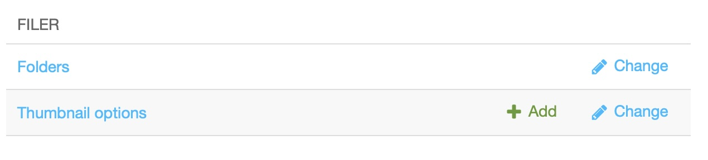

.. _filer:

The media library
=================

The media library holds all the files of your site — images, documents, videos — and
organises them in folders, just like a regular file system. In this lesson you upload
your first image. We will place it on a page in :ref:`lesson 7 <plugins>`.

Open the media library
----------------------

1. Open the **project menu** in the toolbar and select **"Administration..."**. The
   admin sidebar opens.
2. Look for the **Filer** section and click on **"Folders"**:

You see the folders of your media library. The greyed out "Unsorted uploads" folder
contains all the files that do not belong to any folder, for example because they were
uploaded directly to a page.

Create a folder
---------------

Folders keep the library manageable as your site grows. Create one for the images of
this tutorial:

1. Click the **"New Folder"** button at the top right of the folder list.
2. Name the folder "Tutorial" and save.

.. todo::

    **Screenshot needed:** ``tutorial/images/04-filer-new-folder.png`` —
    The filer folder list with the "New Folder" button highlighted and the new
    "Tutorial" folder dialog open. Quickstart project, light colour scheme, browser
    window ~1200 px wide.

.. Uncomment once the screenshot exists:
.. .. image:: ./images/04-filer-new-folder.png
..     :alt: Creating a new folder in the media library

Upload an image
---------------

1. Open the "Tutorial" folder you just created.
2. Drag an image file from your computer into the browser window — or click the
   **upload button** at the top right and pick a file.
3. The image appears in the folder once the upload finishes.

.. todo::

    **Screenshot needed:** ``tutorial/images/04-filer-upload.png`` —
    The inside of a filer folder with one uploaded image visible and the upload
    button at the top right highlighted. Quickstart project, light colour scheme,
    browser window ~1200 px wide.

.. Uncomment once the screenshot exists:
.. .. image:: ./images/04-filer-upload.png
..     :alt: An uploaded image inside a media library folder

Check the image details
-----------------------

Click on the image's name to open its details. Here you can change the **name**, add a
**caption**, and — most importantly — set the **alternative text** ("alt text"), which
is read aloud by screen readers and used when the image cannot be displayed. Fill it
in with a short description of what the image shows, and save.

You can come back to the media library at any time to rename, move or replace files.
The full set of tasks is covered in :ref:`Managing media files <how-to-media-files>`.

.. warning::

    Before deleting a folder or an image, make sure its contents are not used on your
    site. If you delete an image that is still placed on a page, it will disappear
    from that page.
