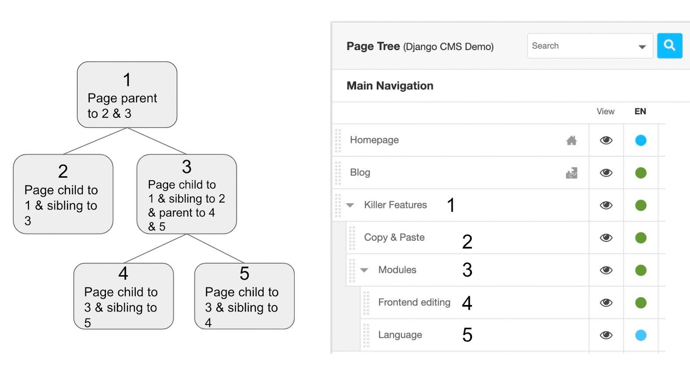

.. _pagetree:

The page tree
=============

Every page of your site has its place in the **page tree**. The tree decides which page
sits below which — and with that, how your visitors navigate the site and how its URLs
are built. In this lesson you open the tree and learn to read it.

Open the page tree
------------------

Open the **project menu** in the toolbar (it carries the name of your site, or
"example.com" on the screenshots here) and choose **"Pages..."**. The sidebar opens and
shows all the pages your site is made of: visible and hidden ones, pages and sub-pages,
published or not.

You can also reach the tree through **"Administration..."** in the same menu, by
clicking "Page contents" in the "django CMS" section.

Parent, child and sibling pages
-------------------------------

Pages are nested inside one another. A page that holds other pages is their **parent
page**; the pages below it are its **child pages**, and each child can have children of
its own. Pages sitting at the same level are **siblings**.

Picture your site as a tree:

- Your **home page** is the trunk.
- The **top-level pages** are the branches growing out of it.
- Their **child pages** are the smaller branches — and those may branch again.
- Pages without any children are the leaves.

    The page tree: pages 3, 4 and 5 form one branch. Pages 2, 4 and 5 are leaves — they
    have no child pages of their own.

Grouping pages this way does more than keep a long list tidy. Pages that belong together
— everything about your company, say — become the children of one parent page, so
readers find their way by moving down the tree. Your site's navigation menu is built
from the same structure, so a well-organised tree makes the site easier to use.

Managing the page tree
----------------------

The page tree is more than a list of your pages: each row tells you the state of a page
and gives you the actions you can perform on it.

.. image:: ./images/05-pagetree-form.jpg
    :alt: Page tree with publication, navigation and page-action controls

Take a moment to look at the row of one of your pages. Next to its **title** you see

- the **status indicator**, whose colour tells you whether the page is published in the
  selected language, has unpublished changes, or does not exist in that language yet,
- the **"Menu"** column, which tells you whether the page is part of your site's
  navigation,
- and, at the right end of the row, the buttons to open the page's **settings**, to add
  a **child page**, and a context menu with further actions.

Above the tree, the language menu decides which language version of the tree you are
looking at; the dotted bar on the left of each row lets you **move pages by drag &
drop**.

.. tip::

    Every symbol used in the tree is listed in the legend, which you open with the
    information icon at the bottom right:

    .. image:: ./images/05-pagetree-legend.jpg
        :alt: Legend for the page tree

You do not need to memorise the tree's controls now — they are all described in the
:ref:`page tree reference <ref-page-tree>`, and the everyday tasks (moving a page,
hiding it from the navigation, setting the home page, deleting it) are covered in
:ref:`Managing pages <how-to-pages>`.
