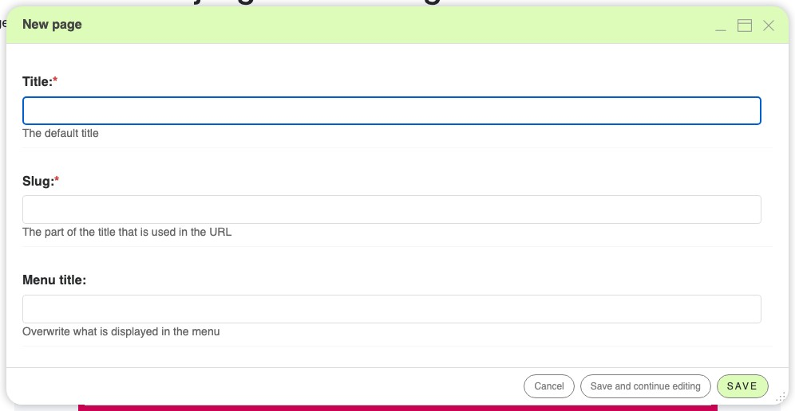

.. _content:

Creating places for content
===========================

Content needs a place to live. Typically those are pages, but you also may have other
content models, like aliases (chunks of content that are reused elsewhere) or blog
posts.

We will work with pages in this guide.

Create a page
-------------

To create a new page, you have three options:

1. Go to the **project menu**, select "Pages...". The sidebar will appear. Click on the
   button "New page" to open the page dialog box.
2. Use the **wizard** by clicking on the "Create" button at the top right of the
   toolbar. The wizard dialog appears, where you can select "New page" or "New sub page"

   .. image:: ./images/06-wizard-1.jpg
       :alt: Step 1 of the wizard dialog

3. In the **"Page" menu**, select "Create a page" then "New page..." (or "New
   sub-page...). The page dialog box appears.

The page dialog is more extensive than the wizard dialog and contains all elements of
the page settings.

In the page dialog box, give a title and possibly a menu and page title then save. The
slug field will be filled automatically based on the page title. Of course, you can
manually change it.

Your newly created page is displayed, as well as the django CMS menu/toolbar with the
main content management tools. A newly created page is empty. Adding content is done via
the structure board, in the upper right corner.

The colour, the size of the text... everything is generated automatically according to
the page template of your site which in turn should be based on your individual graphics
design. To change the design, there are options to modify the page template. If you want
to change the design, talk to the developers to review it.

.. _page-settings:

Change page settings
--------------------

Every page has a set of settings — its title, the slug that forms its URL, how it
appears in the navigation, and more. They are the same fields you saw in the page
dialog. To review them, select **"Page settings..."** in the page menu, or click the
settings icon of the page's row in the page tree.

The two fields you will always fill in are:

- **Title** — the title of the page. It is displayed by your site's template, used in
  the browser tab and by search engines, and reused in the navigation menu unless you
  set a separate menu title.
- **Slug** — the part of the URL that identifies the page. It is generated
  automatically from the title; keep it short and meaningful.

.. note::

    For your SEO, it is valuable that the title and slug of your page contain words
    related to its content.

Close the dialog again — we will fill the page with content in the next lesson. All
other fields, including the URL options and the advanced settings, are described in the
:ref:`page settings reference <ref-page-settings>`.
