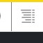
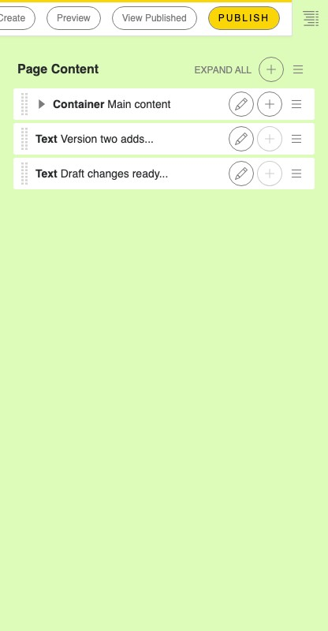
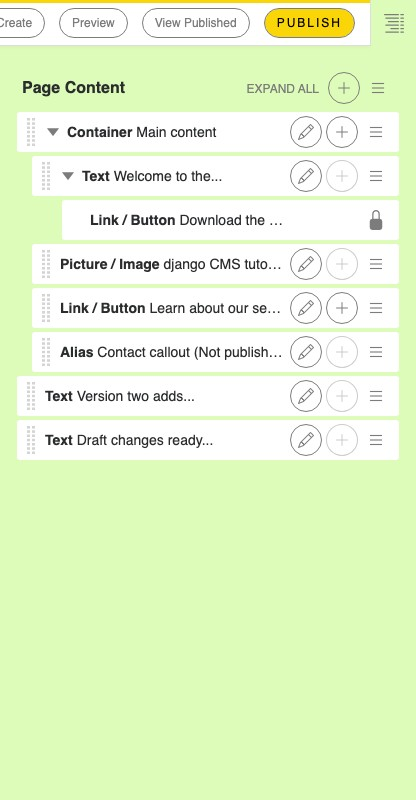
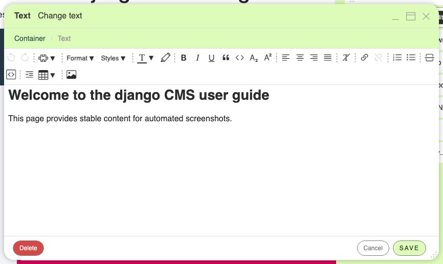
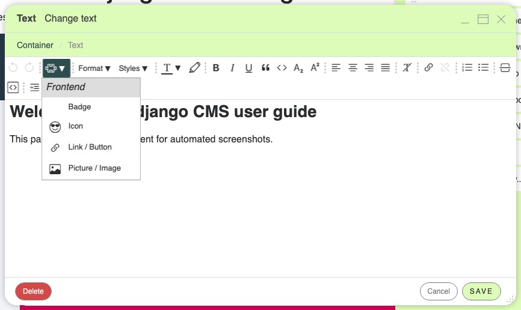

.. _plugins:

Filling in content
==================

Your page is empty. Time to fill it.

Content in django CMS is not one long text. It is made of **plugins** — a text, an
image, a row of columns, a carousel — placed inside the **placeholders** that your
page's template offers. In this lesson you add your first plugins, arrange them, and
edit them again.

Open the structure board
------------------------

Click the **structure board toggle** at the far right of the toolbar:

The structure board opens beside your page and shows its placeholders — the regions your
template makes editable. On a new page they are still empty.

.. note::

    Which plugins your site offers depends on the packages installed on it, so your list
    may differ from the screenshots here. The way you work with plugins is always the
    same.

Add your first plugin
---------------------

1. Click the **add button** of the placeholder you want to fill. A dialog lists the
   plugins you can use at this position.

   .. image:: ./images/07-add-plugin.jpg
       :alt: Select a plugin to add

2. Choose a **Container** — a plugin that groups the content of one section of your
   page.
3. Click **"Save"**. The container has no required fields, so there is nothing to fill
   in.

   .. image:: ./images/07-add-container.jpg
       :alt: Add container dialog box

The plugin now appears both on your page and in the structure board. Adding content is
this step, repeated: pick a place, pick a plugin, fill in its form.

.. note::

    Every plugin brings its own dialog. The container used here is one of the plugins
    provided by the django CMS Frontend package, which are designed to structure a page.
    Their options are grouped in the blue tabs at the top of the dialog, and nearly all
    of them are optional.

Nest and rearrange plugins
--------------------------

Some plugins hold others: a text sits inside a column, the column inside a container.
When a plugin accepts children, its entry in the structure board has an add button of
its own, and a triangle next to the drag handle that shows or hides what is nested
inside it.

To change the order of your content — to move an image above a text, say — take hold of
the plugin by the dotted handle on the left of its entry and **drag** it to its new
place.

.. tip::

    Hold the **SHIFT** key while hovering over an entry in the structure board and the
    matching element is highlighted on the page. It is the quickest way to tell which
    entry belongs to which piece of content.

Edit a plugin
-------------

To change something you have already added, either

- **double-click** the content on the page, or
- click the **pencil icon** of its entry in the structure board.

The dialog you filled in when you created the plugin opens again.

Add text
--------

Add a **Text** plugin inside your container: the rich text editor opens, and it works
like any editor you know. Type your text, format it with the toolbar, and save.

.. tip::

    If your installation has inline editing enabled, you can even edit text right on the
    web page if the pencil button in the toolbar is activated:

    .. image:: ./images/07-inline-editing.jpg
        :alt: django CMS text inline editing

.. tip::

    Each entry in the structure board shows a few words of its content, but a long page
    still produces a long tree. Give each of your containers a **title**: it is shown in
    the structure board instead of the summary, so using one container per section of
    the page — "Hero", "Team", "Contact" — turns the tree into a table of contents.

Plugins can also live *inside* a text. Open the **"CMS Plugins"** menu of the editor and
you can insert, for example, a link to another page of your site: a dynamic link that
keeps working even if the destination page's address changes later.

.. tip::

    To remove a plugin from a text again, select it in the editor and press backspace or
    delete. If the plugin appears to be empty and is hard to select, place the cursor
    directly behind it and press backspace.

Images
------

Let's place the image you uploaded to the media library in :ref:`lesson 4 <filer>` on
your page:

1. Open the **structure board** and click the **add button** of your placeholder (or
   of the container you created earlier).
2. Select the **"Picture / Image"** plugin from the list.
3. Click the magnifier next to the **"Image"** field, navigate to your "Tutorial"
   folder and pick your image.
4. Save the dialog. Your image appears on the page.

.. todo::

    **Screenshot needed:** ``tutorial/images/07-add-image.jpg`` —
    The "Picture / Image" plugin dialog with an image selected from the media
    library's "Tutorial" folder. Quickstart project, light colour scheme, browser
    window ~1200 px wide.

.. Uncomment once the screenshot exists:
.. .. image:: ./images/07-add-image.jpg
..     :alt: Adding an image with the Picture / Image plugin

Links
-----

Now make a piece of your text link to another page of your site:

1. Edit your text plugin and place the cursor where the link should appear.
2. Open the **"CMS Plugins"** menu in the editor's toolbar and select the
   **"Link / Button"** plugin.
3. Enter the link text, choose a page of your site in the **"Internal link"** field,
   and save.
4. Save the text plugin. The link is now part of your text — and because it is a
   dynamic link, it keeps working even if the destination page's URL changes later.

Where to go from here
---------------------

You now know the editing workflow: open the structure board, add plugins, arrange and
edit them. The how-to guides cover the everyday tasks in more depth — for example
:ref:`adding images <how-to-add-image>`, :ref:`creating links and buttons
<how-to-links>` and :ref:`reusing content with aliases <how-to-aliases>` — and the
:ref:`plugin reference <ref-plugins>` lists all plugins that ship with the quickstart
project. Next, in the final lesson, you publish your work.
